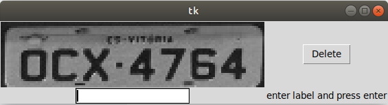
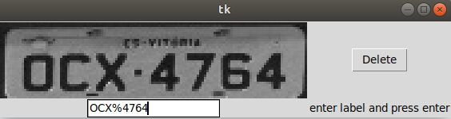

# License Plate Labeling Tool

1. Install Tkinter: `sudo apt-get install python3-tk`;

2. `pip install -r requirements.txt`;

3. place the data you want to label in `/raw`;

4. `python app.py`

    
    
5. Insert the label and press enter. *Note*: denote spaces as %;

    
    
    If you don't need the image, press Delete.
    
6. The resulting file is `/results/OCX%4764_<random_string>.jpg`; A `random_string`
is added to avoid overwriting the duplicates.